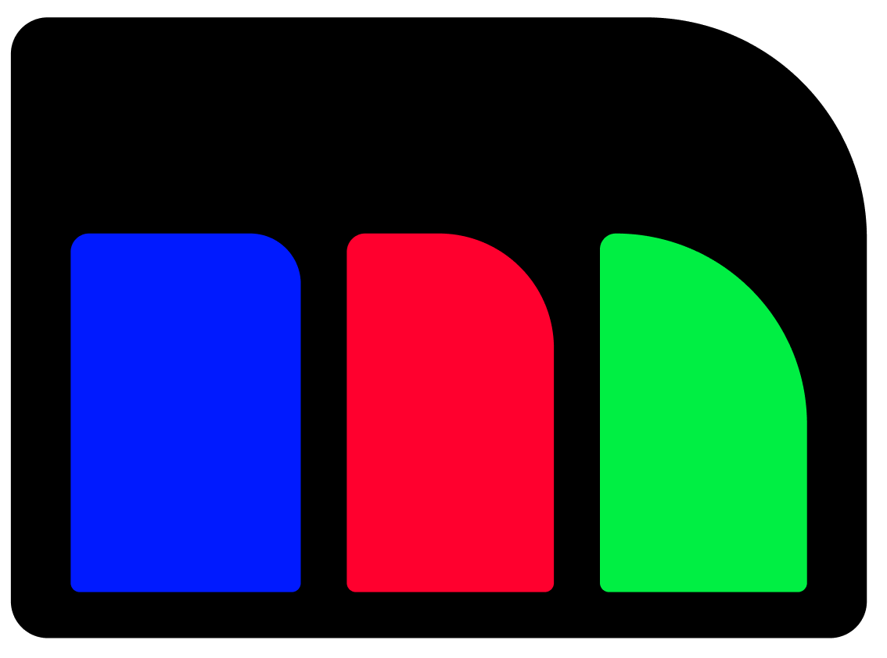

#  Multinear: Reliable AI Agents

<!--  -->

<!-- For full documentation visit [mkdocs.org](https://www.mkdocs.org). -->

Multinear is an online platform where people build AI that works predictably. 

It allows anyone to explore, learn, experiment, collaborate, and build trustworthy systems. 

Are you ready to join the path towards reliable AI?

---

- [Introduction](intro.md)
- [Projects](projects.md)

---
[Request Access :material-chevron-double-right:](https://app.youform.com/forms/guvtbe1v){ .md-button }
